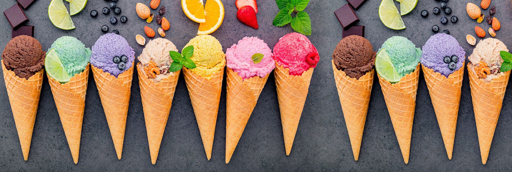
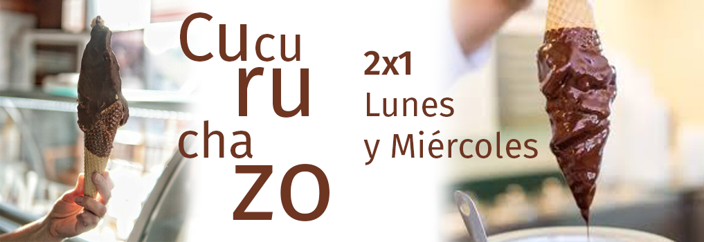

# Heladería "Frosty One-Page"
Bienvenidos a la Heladería "Frosty One-Page", un proyecto de sitio web en formato one-page que ofrece una experiencia única a nuestros clientes.

## Secciones del Sitio

### Header
En esta seccion se muestra el menu de navegación y nuestras redes (formato desktop) que es responsivo adaptandose a distintas pantallas.

### Inicio
En esta sección se presenta un carrusel (carousel) de Bootstrap con imágenes de nuestras increibles promociones.

### Inicio de Sesión
Los usuarios pueden iniciar sesión en la plataforma a través de esta sección.

### Descripción de Sabores
Aquí se muestran los diferentes sabores de helados que ofrecemos, con sus respectivas descripciones.

### Formulario de Contacto
Los clientes pueden ponerse en contacto con nosotros a través de este formulario, donde pueden enviar sus consultas o sugerencias.

### Sucursales
En esta sección se presentan las direcciones y horarios de nuestras sucursales.

### Footer
El footer del sitio web incluye información de derechos de autor, redes sociales y enlaces a políticas y términos.

## Tecnologías Utilizadas

- HTML
- CSS
- Bootstrap
- JavaScript

## Integrantes del Proyecto

- Gabriela Cinto
- Lesliee Aquino
- Felipe Groisman
- Marcelo Motto

¡Esperamos que disfrutes de nuestra heladería virtual! Si tienes alguna pregunta o sugerencia, no dudes en contactarnos.
